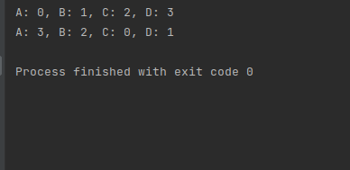
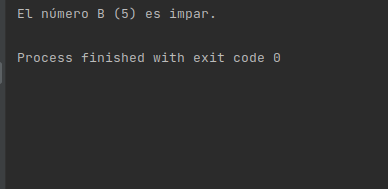
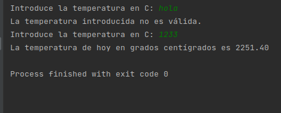
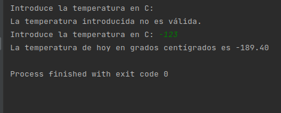
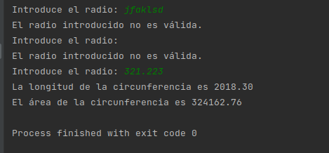
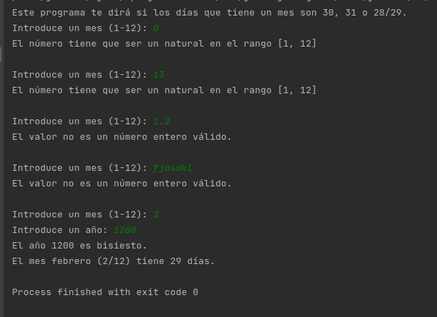
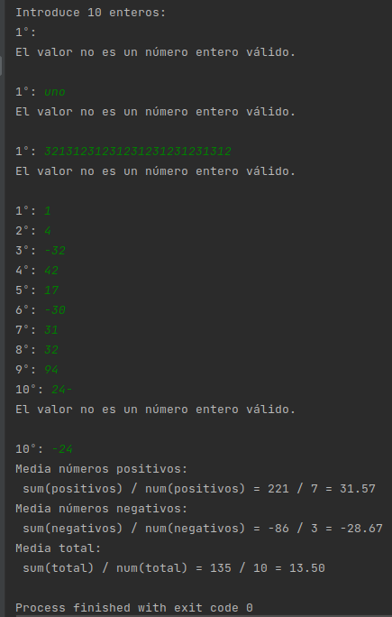
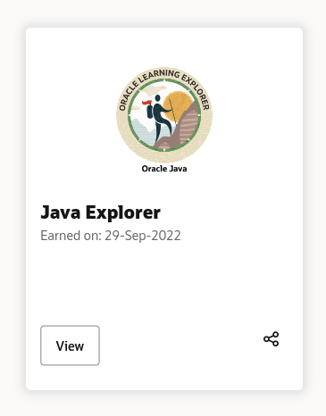

# Interfaces UF1:

Actividades propuestas en la Unidad Formativa 1 de la asignatura de interfaces.

## Enunciado:
Una vez realizados los ejercicios de la UF1 se quiere documentar los ejercicios realizados, 
desde el 1 al 4. Para ello se pide entregar: 
1. Del ejercicio 1 una pantalla del IDE que demuestre que se ha realizado el ejercicio y 
que funciona. Alternativamente es posible entregarlo mediante Github –introducir el 
link para acceder al repositorio de Github donde ha introducido el programa. 
2. Del ejercicio 2 una pantalla del IDE que demuestre que se ha realizado el ejercicio y 
que funciona. Alternativamente es posible entregarlo mediante Github –introducir el 
link para acceder al repositorio de Github donde ha introducido el programa. 
3. Del ejercicio 3 una pantalla del IDE que demuestre que se ha realizado el ejercicio y 
que funciona. Alternativamente es posible entregarlo mediante Github –introducir el 
link para acceder al repositorio de Github donde ha introducido el programa. 
4. Del ejercicio 4 una pantalla del IDE que demuestre que se ha realizado el ejercicio y 
que funciona. Alternativamente es posible entregarlo mediante Github –introducir el 
link para acceder al repositorio de Github donde ha introducido el programa. 
5. Opcional: Entregar una pantalla que demuestre que se ha completado el Java Explorer 
o el badge que entrega Oracle tras completar el Java Explorer, de repaso

## Ejercicio 1:
### Ej1:

### Ej2:

## Ejercicio 2:
### Ej1:

### Ej2:

## Ejercicio 3:

## Ejercicio 4:

## Java Explorer:

